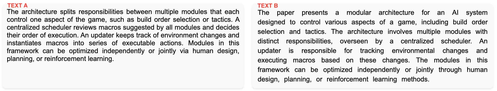
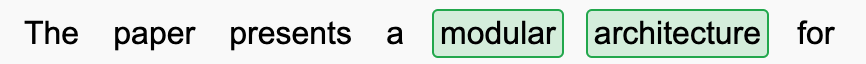
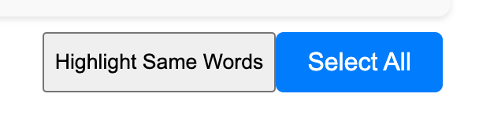
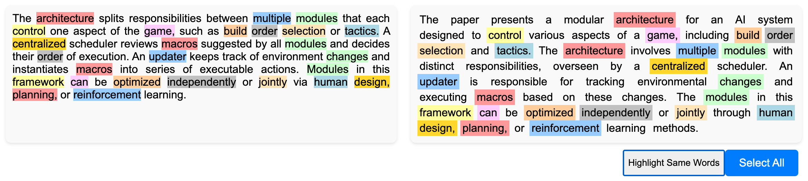
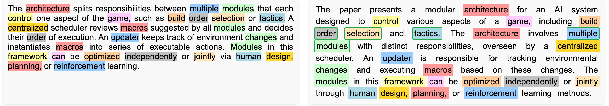
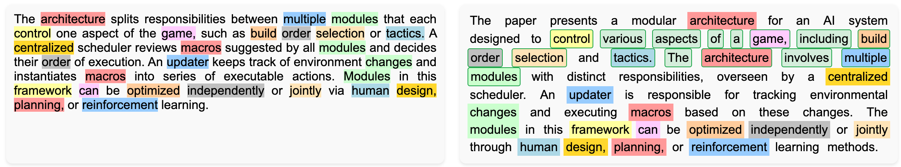
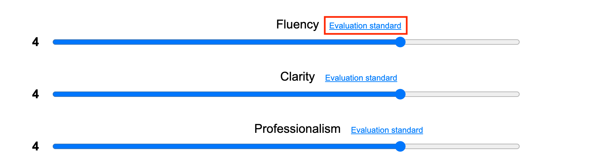
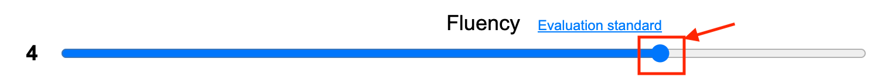
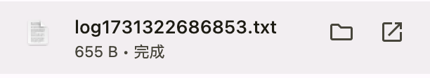

# GUIDE BOOK
Please first visit the web page through the following link [web_page](http://47.95.158.98:8530/)

In this guide, we will briefly introduce the questions that testers need to answer and how to answer them when using the web page.

First of all, this page contains two questions, one is a **multiple choice question** and the other is a **scoring question**. We will introduce these two questions separately.

## Multiple Choice Question
### Question Setting
At the top of the webpage, you can see two texts on the left and right. We name the text on the left Text A and the text on the right Text B. 

We hope that readers will first read Text A, understand the content described in Text A, and then **choose the part of Text B that they think is inspired by Text A**.

We provide some examples of the inspiration for reference only:
- The same nouns or sentences as those in Text A also appear in Text B.
- The general meaning of a part of the content in Text A is also mentioned in Text B.

### Answering process
If you think a part of text B meets the question, you can directly **click on the words** in that part to select the area you want to select. The selected words will be circled in a green box.

We have designed two buttons to help you answer questions: a Highlight button and a Select All button.

For Select All button, if you think the entire Text B is inspired by Text A, you can click this button directly. It will automatically select all Text B for you.

As for Highlight button, if you find it difficult to read the text, clicking this button will highlight the meaningful words which both appear in Text A and Text B. Clicking it again will make the highlight disappear.

**Attention:** This function is for reference only and does not guarantee that all identical words are included. Please read the full text and answer the question based on your own understanding.

### Example for reference
We give a simple example to help users understand the entire process of answering multiple choice questions. Please note that this example is for reference only. Please answer the questions according to your own understanding of inspiration.

When answering multiple-choice questions, we recommend that users follow the following answer order.
1. Read one sentence from Text A and understand its meaning.
2. Select the part in Text B that you think meets the question. You can **click on any word to select the part you want**.
3. Repeat steps 1 and 2 until you have read all the sentences in Text A.
4. Finally, based on your understanding of the entire Text A, select all the parts of Text B that you think fit the question.

First, by reading the first sentence of Text A, I learned that this sentence mentioned three keywords: order selection, tactics and multiple modules. These words are not commonly used in daily writing, so I think the part where the three keywords apper in Text B are inspired by Text A.

Secondly, this sentence means that the architecture is divided into multiple modules to control the game. So based on the previous step, I continued to select the first and second sentence in Text B that contains a similar meaning. 

And so on, repeat the above two steps repeatedly until you have read all the sentences in Text A.

## Scoring Question
### Question Setting
We hope that testers will rate the quality of Text B from three aspects: fluency, clarity and professionalism. Each aspect can be scored from **1 to 5 point**. If you are confused about the scoring criteria for a certain aspect, please click the corresponding **evaluation standard** button, and the webpage will display the description corresponding to each score of this aspect.

### Answering process
You only need to **drag the button on each horizontal frame** to move left and right to rate.

## Submission
Once you have completed all questions please **click the Submit button**. If you want to continue answering after submission, just **refresh the page**.

Each time you click the submit button, the browser will automatically download a txt file starting with **"log"**. Please put these files into a folder and send them to the following email address: **dou@nii.ac.jp**

